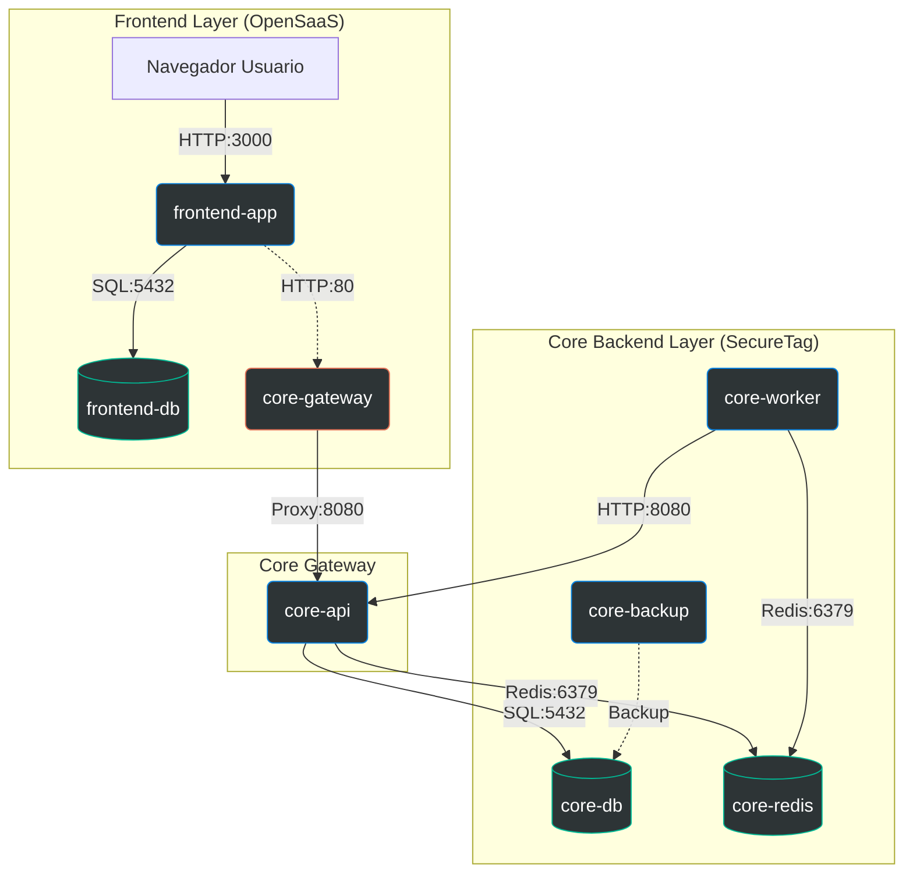

# Análisis de Arquitectura FullStack - SecureTag Agent

**Fecha:** 2026-01-01
**Versión:** 1.1
**Estado:** Documento de Referencia Actualizado

## 1. Visión Global del Sistema

SecureTag Agent opera bajo una arquitectura de microservicios híbrida, combinando un **Frontend SaaS** (basado en Wasp) con un **Core Backend** (Node.js/TypeScript) y un **Worker System** para procesamiento asíncrono. La infraestructura se despliega mediante contenedores Docker orquestados, con integración a servicios de IA externos (OpenAI, Anthropic) y locales/privados (Ollama, RunPod).

### 1.1 Inventario de Contenedores y Red
El sistema se comunica a través de la red bridge `core-net`. A continuación se detallan todos los contenedores activos detectados en tiempo de ejecución:

#### Frontend (OpenSaaS)
| Contenedor | Imagen (Runtime) | Rol | Puertos | Dependencias |
| :--- | :--- | :--- | :--- | :--- |
| **frontend-app** | `app-app` | Aplicación Fullstack (React + Node.js). Interfaz de usuario, gestión de cuentas y facturación. | 3000-3001:3000-3001 | `frontend-db` |
| **frontend-db** | `postgres:15` | Base de datos dedicada para el Frontend (Usuarios, Pagos, Créditos). | 5433:5432 | N/A |

#### Core Backend (SecureTag)
| Contenedor | Imagen (Runtime) | Rol | Puertos | Dependencias |
| :--- | :--- | :--- | :--- | :--- |
| **core-api** | `securetag-app:dev` | API REST Core. Gestión de Tenants, orquestación de tareas y almacenamiento de resultados. | 8080 (interno) | `core-db`, `core-redis` |
| **core-worker** | `securetag-worker:dev` | Procesamiento pesado asíncrono (SAST, IA, Reportes). Escala horizontalmente. | N/A | `core-redis`, `core-api` |
| **core-gateway** | `nginx:alpine` | Proxy Reverso y Gateway para la API Core. | 80:80 | `core-api` |
| **core-db** | `postgres:18.1` | Base de datos principal para lógica de negocio de ciberseguridad y multitenancy. | 5432 (interno) | N/A |
| **core-redis** | `redis:alpine` | Cola de tareas (BullMQ) y Caché de alto rendimiento. | 6379:6379 | N/A |
| **core-migrate** | `liquibase/liquibase:4.24` | Gestión de migraciones de base de datos (Schema Versioning). | N/A | `core-db` |
| **core-backup** | `postgres:18.1-alpine` | Servicio de backups automatizados con cifrado y rotación (Cron Job). | 5432 (interno) | `core-db` |

### 1.2 Mapa Visual de Arquitectura (Runtime)

### 1.3 Topología de Red (`core-net`)
*   **Comunicación Frontend -> Backend**: `frontend-app` consume la API a través de `http://core-gateway:80` (nombre de servicio DNS interno de Docker).
*   **Comunicación Worker -> Backend**: `core-worker` reporta estado y resultados a `http://core-api:8080` o directamente vía DB/Redis según el caso.
*   **Aislamiento**: `core-db` no expone puertos al host (por defecto), solo es accesible dentro de la red docker. `frontend-db` expone el 5433 para administración local.

### 1.4 Mapeo de Rutas de Código a Contenedores

Para facilitar el desarrollo y mantenimiento, se define explícitamente qué carpetas del repositorio alimentan a cada servicio en ejecución.

#### Grupo A: Frontend Dashboard (OpenSaaS)
*Raíz del código fuente: `/Users/master/Downloads/Securetag Agent/frontend/open-saas-main`*

| Contenedor | Ruta Relativa (desde frontend/) | Descripción del Contenido |
| :--- | :--- | :--- |
| **frontend-app** | `app/` | **Código Fuente de la App**. Contiene toda la lógica React (client) y Node.js (server), definición de API (`main.wasp`) y estilos. |
| **frontend-app** | `app/.wasp/out/` | **Código Generado**. El contenedor ejecuta realmente lo que Wasp compila en esta carpeta oculta. |
| **frontend-db** | `app/db/` (Referencia) | Aunque la DB es una imagen estándar de Postgres, su esquema y migraciones se definen aquí (`schema.prisma`, `migrations/`). |

#### Grupo B: Core Backend (SecureTag Agent)
*Raíz del código fuente: `/Users/master/Downloads/Securetag Agent`*

| Contenedor | Ruta Relativa (desde raíz) | Descripción del Contenido |
| :--- | :--- | :--- |
| **core-api** | `src/server/` | **API Server**. Código fuente de la API REST, rutas y controladores. |
| **core-api** | `src/middleware/` | Middleware de seguridad y autenticación para el servidor. |
| **core-worker** | `src/worker/` | **Worker Process**. Lógica de colas, análisis SAST y orquestación de IA. |
| **core-worker** | `src/utils/` | Utilidades compartidas inyectadas también en el worker. |
| **core-gateway** | `nginx/default.conf` | Configuración del Proxy Reverso. Define reglas de ruteo y timeouts. |
| **core-db** | `data/postgres` (Volumen) | Persistencia de datos. No hay código fuente per se, pero los datos viven en este volumen mapeado. |
| **core-redis** | `data/redis` (Volumen) | Persistencia de colas y caché. |
| **core-backup** | *Sin mapeo directo* | Usa imagen estándar `postgres:18.1-alpine`. Se configura vía variables de entorno en `docker-compose.yml`. |
| **core-migrate** | *Sin mapeo directo* | (Si existiera carpeta `migrations/` SQL nativo, iría aquí). Actualmente usa imagen estándar liquibase. |
| **Build Context** | `docker/` | Dockerfiles para construir las imágenes `securetag-app` y `securetag-worker`. |

---

## 2. Estructura de Datos (High-Level)

El sistema mantiene una separación estricta de responsabilidades entre la gestión comercial (Frontend) y la operativa (Core).

### 2.1 Base de Datos Frontend (`opensaas-db`)
Gestionada por Prisma (Schema en `main.wasp`). Enfocada en **Identidad y Facturación**.

*   **`User`**: Identidad del usuario final, credenciales, email, rol.
*   **`Organization`**: Agrupación lógica de usuarios (si aplica).
*   **`CreditUsage`**: Historial de consumo de créditos (débitos por escaneos).
*   **`Payment`**: Registro de transacciones monetarias (PayPal/Stripe).
*   **`ApiKey`**: Llaves generadas para acceso programático al Core.
*   **`DailyStats` / `Logs`**: Telemetría y auditoría de acceso al frontend.
*   Nota: las migraciones se ejecutan así: docker exec opensaas-app npx prisma migrate dev --name add_deleted_at_to_user --schema .wasp/out/db/schema.prisma

### 2.2 Base de Datos Core (`securetag-db`)
Gestionada por Liquibase (SQL Nativo). Enfocada en **Operaciones de Seguridad y Multitenancy**. Esquema principal: `securetag`.

*   **Gestión de Tenants**:
    *   **`tenant`**: Entidad raíz. Almacena configuración global y **saldo de créditos espejo** (`credits_balance`).
    *   **`app_user`**: Usuarios replicados o vinculados al tenant.
    *   **`api_key`**: Llaves de API válidas para autenticación directa.

*   **Motor de Escaneo**:
    *   **`project`**: Contenedor de escaneos para un repositorio/fuente específico.
    *   **`task`**: Unidad de trabajo (Scan Job). Estados: `queued`, `running`, `completed`, `failed`.
    *   **`scan_result`**: Resumen de alto nivel de un escaneo completado.
    *   **`finding`**: Hallazgos individuales (Vulnerabilidades). Contiene:
        *   `severity`, `category` (SAST).
        *   `ai_analysis` (Resultado del análisis cognitivo).
        *   `evidence` (Snippet de código, línea, archivo).

*   **Seguridad y Reglas**:
    *   **`custom_rule_library`**: Reglas SAST definidas por el usuario.
    *   **`security_event`**: Logs de seguridad (intentos de acceso, WAF).
    *   **`ip_reputation`** & **`security_strike`**: Control de rate-limiting y bans automáticos.

---

## 3. Flujo de Datos: Proceso de Escaneo (SAST)

El flujo crítico de negocio es el análisis de código estático (SAST) con enriquecimiento de IA.

1.  **Inicio (Frontend)**:
    *   El usuario sube un archivo ZIP en `NewScanPage`.
    *   **Validación de Créditos (SaaS)**: Se calcula un *costo estimado* (Base + Extras) y se descuenta *inmediatamente* de la DB local del Frontend (`prisma.user.update`).
    *   **Envío**: El Frontend envía el archivo y metadatos a `securetag-app` (`POST /codeaudit/upload`).

2.  **Recepción (Core API)**:
    *   `securetag-app` recibe el archivo, valida el Tenant y crea un registro en `securetag.task` con estado `running` (o `queued`).
    *   El archivo se almacena en el sistema de archivos compartido (`/var/securetag/...`).

3.  **Procesamiento (Worker)**:
    *   `TaskExecutor.ts` toma la tarea.
    *   **Fase 1: Preparación**: Descomprime, analiza contexto del proyecto, valida seguridad del contexto (Guardrails).
    *   **Fase 2: Ejecución SAST**:
        *   Genera reglas personalizadas (si aplica).
        *   Ejecuta `semgrep` con reglas locales y generadas.
        *   Ejecuta análisis Cross-File (si es Premium).
    *   **Fase 3: Análisis Cognitivo (IA)**:
        *   Itera sobre los hallazgos.
        *   Usa `LLMClient` (Ollama/RunPod) para validar (True/False Positive) y sugerir correcciones.
        *   **Double Check (On-Demand)**: Si el usuario solicita una segunda opinión, se ejecuta una transacción puntual.

4.  **Consumo de Resultados (Frontend)**:
    *   El usuario consulta `ScanResultsPage`.
    *   Frontend llama a `GET /codeaudit/:id` en Core API.
    *   **Sincronización de Créditos**: En `getSastDashboard`, el Frontend compara su saldo local con el que reporta el Backend (si existe). Si hay discrepancia, intenta sincronizar.

---

## 4. Economía de Créditos (Liquidación Diferida)

El sistema implementa un modelo híbrido de cobro:

1.  **Costo Base (Upfront)**: Cobrado en el Frontend antes de iniciar el escaneo. Cubre el procesamiento estándar.
2.  **Costos Variables (On-Demand)**:
    *   Acciones como "Double Check" (Segunda Opinión de IA) tienen un costo por uso.
    *   Estos se validan contra el saldo disponible en el Backend (`securetag.tenant.credits_balance`).
    *   Si el saldo es suficiente, se ejecuta la acción y se descuenta en el Backend.
    *   Posteriormente, el Frontend sincroniza este nuevo saldo para reflejarlo en la UI del usuario.

---

## 5. Puntos Clave de Código

*   **Frontend**:
    *   `src/server/actions/sast.ts`: Lógica de cobro inicial y llamada a API.
    *   `src/shared/sastCosts.ts`: Fórmulas de estimación de costos.

*   **Worker**:
    *   `src/worker/TaskExecutor.ts`: Lógica principal del escaneo.
    *   `src/worker/services/CreditsManager.ts`: Gestión de créditos en DB Core.

*   **Core API**:
    *   `src/server/routes/tenant.ts`: Endpoint `/api/v1/tenant/credits/sync` para sincronización.
