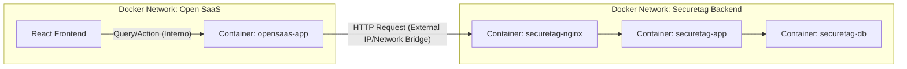

# Plan de Conexión Backend - Securetag SaaS (Arquitectura Proxy/BFF)

**Fecha**: 2025-12-25
**Autor**: Agente Frontend
**Referencia**: Sub-documento técnico de `PLAN_Frontend_Integration.md`

## 1. Contexto y Objetivos

Para conectar el Frontend de Open SaaS con la API existente de Securetag (`http://143.198.61.64:8080`), implementaremos un patrón **Backend-for-Frontend (BFF)** utilizando el servidor Node.js de Wasp como intermediario.

### ¿Por qué esta arquitectura?
1.  **Seguridad (Security by Design)**:
    *   Oculta la lógica de negocio y las transformaciones de datos.
    *   Evita exponer credenciales sensibles o la estructura interna de la API en el navegador del cliente.
2.  **CORS y Red**:
    *   Elimina problemas de Cross-Origin Resource Sharing (CORS) ya que el navegador solo se comunica con su propio dominio (`localhost:3000` -> `localhost:3001`).
    *   La comunicación con la API externa ocurre de servidor a servidor (Docker -> DigitalOcean).
3.  **Abstracción**:
    *   Permite transformar respuestas "crudas" de la API legacy en formatos limpios que la UI moderna espera, sin ensuciar el código React.

---

### 2. Arquitectura de la Solución (Docker-Aware)



**Puntos Críticos de Red**:
1.  **Aislamiento de Redes**:
    *   `opensaas-app` corre en su propia red default (creada por `docker-compose.yml` de Open SaaS).
    *   `securetag-app` corre en `securetag-net` (creada por el `docker-compose.yml` principal).
    *   **Solución**: Como son composes separados, el contenedor `opensaas-app` **NO** puede resolver `securetag-nginx` por nombre de host DNS automáticamente a menos que los unamos a la misma red externa.
    *   **Alternativa Práctica**: Usar `host.docker.internal` (si Docker Desktop lo soporta) o la IP del host donde corre Docker, o simplemente conectar vía la IP pública/local expuesta `localhost:80` (mapped port).
    *   *Nota*: Dado que `securetag-nginx` expone el puerto `80` al host (`0.0.0.0:80->80/tcp`), `opensaas-app` puede contactarlo usando `http://host.docker.internal:80` (en Mac/Windows) o la IP de la máquina host.

2.  **Reverse Proxy (Nginx)**:
    *   El Backend Securetag tiene un Nginx (`securetag-nginx`) en frente.
    *   Nuestras peticiones deben ir dirigidas a Nginx (Puerto 80), no directamente a `securetag-app` (Puerto 8080), para respetar la arquitectura de producción.

---

## 3. Estrategia de Implementación (Paso a Paso)

### Paso 1: Configuración de Red e Integración
**Estado**: ✅ Completado
**Objetivo**: Asegurar visibilidad entre contenedores.

1.  **Configurar URL Base**:
    *   En `.env.server` (dentro de `opensaas-app`), establecer `SECURETAG_API_URL`.
    *   **Configuración Final (Docker to Docker)**: `SECURETAG_API_URL=http://securetag-nginx:80`.
    *   **Configuración Host (Header)**: `SECURETAG_API_HOST=api.securetag.com.mx` (Necesario para pasar validación de Nginx).
    *   **Conexión de Red**: Se requiere conectar manualmente el contenedor `opensaas-app` a la red `securetag-net` (`docker network connect securetag-net opensaas-app`).

2.  **Validar Conectividad**:
    *   Query `checkApiConnection` implementada y probada.
    *   Endpoint verificado: `/healthz` (Devuelve 200 OK).

### Paso 2: Cliente Centralizado (`src/server/securetagClient.ts`)
**Estado**: ✅ Completado
Módulo TypeScript que actúa como **único punto de salida** hacia la API externa.
*   **Tecnología**: `axios` (para manejo robusto de headers y timeouts).
*   **Responsabilidad**:
    *   Configurar `baseURL` desde variables de entorno.
    *   Inyectar automáticamente el header `X-API-Key`.
    *   **Inyectar header `Host`** para compatibilidad con Nginx Proxy.
    *   Estandarizar errores (ej: convertir 401 de API externa en excepción de Wasp).

#### B. Capa de Operaciones Wasp (Queries & Actions)
**Estado**: ✅ Completado (Health Check Verificado)
Interfaz pública que el Frontend consume.
*   **Queries (Lectura)**: `getDashboardMetrics`, `getProjects`, `getScanResults`.
*   **Actions (Escritura)**: `startScan`, `updateSettings`.
*   Estas operaciones **NO** contienen lógica de negocio compleja; solo orquestan la llamada al `securetagClient` y devuelven datos.

#### C. Gestión de Credenciales
El sistema aprovecha la autenticación de Wasp:
1.  Usuario hace login en SaaS.
2.  En cada petición, Wasp provee el contexto del usuario (`context.user`).
3.  El servidor extrae `context.user.securetagApiKey` de la base de datos local (Postgres).
4.  Esta llave se usa para instanciar el cliente HTTP efímero para esa petición.

---

## 3. Estrategia de Implementación (Paso a Paso)

### Paso 1: Configuración Base y "Health Check" (Prueba de Humo)
**Objetivo**: Confirmar que el contenedor Docker puede "ver" y hablar con la API externa.
1.  Definir variable `SECURETAG_API_URL` en `.env.server`.
2.  Crear `src/server/securetagClient.ts` (esqueleto básico).
3.  Implementar Query `checkApiConnection` que haga un ping o petición simple a la API externa.
4.  Crear un componente temporal en UI o usar logs para verificar éxito.

### Paso 2: Mapeo de Endpoints Críticos (SAST)
**Estado**: ✅ Completado
**Objetivo**: Conectar las vistas ya creadas con datos reales.

| Vista Frontend | Operación Wasp | Endpoint Securetag | Estado | Notas |
| :--- | :--- | :--- | :--- | :--- |
| **Dashboard** | `getSastDashboard` | `GET /dashboard/stats` | ✅ Completado | Refactorizado: Backend Core ahora provee métricas agregadas. Frontend consume endpoint directo. |
| **Nuevo Escaneo** | `createScan` | `POST /codeaudit/upload` | ✅ Completado | Implementado carga de archivos ZIP (Base64 -> Blob). |
| **Proyectos** | `getProjects` | `GET /projects` | ✅ Completado | Lista completa de proyectos. |
| **Historial** | `getProjectHistory` | `GET /projects/:alias/history` | ✅ Completado | Detalle de escaneos enriquecido con conteo de vulnerabilidades por severidad (Critical, High, Medium, Low, Info) y Total. Verificado y visualizado en Frontend. |
| **Resultados** | `getScanResults` | `GET /codeaudit/:taskId` | ✅ Completado | Reporte completo de vulnerabilidades. Integrado con filtros, ordenamiento y visualización de detalles (AI Analysis, Code Evidence). |

### Paso 3: Manejo de Errores y Edge Cases
**Objetivo**: Robustez.
*   Manejar timeouts (si la API externa es lenta).
*   Manejar `401 Unauthorized` (si la API Key del usuario caducó o es inválida) -> Frontend debe pedir re-ingreso.
*   Manejar `500 Server Error` de la API externa -> Mostrar "Servicio no disponible" amigable.

### 4. Consideraciones de Despliegue (Roadmap)

#### Fase de Desarrollo (Actual)
*   **Estrategia**: Redes separadas.
*   **Conexión**: `http://host.docker.internal:80`.
*   **Justificación**: Permite iterar rápido sin modificar los `docker-compose.yml` existentes ni detener servicios.

#### Fase de Producción (Single Droplet)
*   **Estrategia**: Red Unificada (API First).
*   **Conexión**: `http://securetag-nginx`.
*   **Justificación**:
    *   **Performance**: Comunicación directa contenedor-a-contenedor sin overhead de red host.
    *   **Seguridad**: El Backend puede dejar de exponer puertos al exterior y solo aceptar tráfico del Frontend (y Nginx público).
    *   **Arquitectura**: Consolida el modelo donde el Frontend es un cliente privilegiado más de la API Core.

---

## 5. Referencias Técnicas

### Configuración de Entorno
```bash
# .env.server
# DESARROLLO (Docker Desktop / Host Gateway)
SECURETAG_API_URL=http://host.docker.internal:80

# PRODUCCIÓN (Red Interna)
# SECURETAG_API_URL=http://securetag-nginx
```

### Estructura de `securetagClient.ts` (Propuesta)
```typescript
import axios from 'axios';
import { HttpError } from 'wasp/server';

export const createSecuretagClient = (apiKey: string) => {
  const client = axios.create({
    baseURL: process.env.SECURETAG_API_URL,
    headers: {
      'X-API-Key': apiKey,
      'Content-Type': 'application/json',
    },
    timeout: 10000, // 10s timeout
  });

  // Interceptor para manejo de errores estandarizado
  client.interceptors.response.use(
    response => response,
    error => {
      // Log error interno
      console.error('Securetag API Error:', error.message);
      
      if (error.response?.status === 401) {
        throw new HttpError(401, 'Invalid or expired Securetag API Key');
      }
      throw new HttpError(502, 'Bad Gateway: Failed to contact Securetag API');
    }
  );

  return client;
};
```
