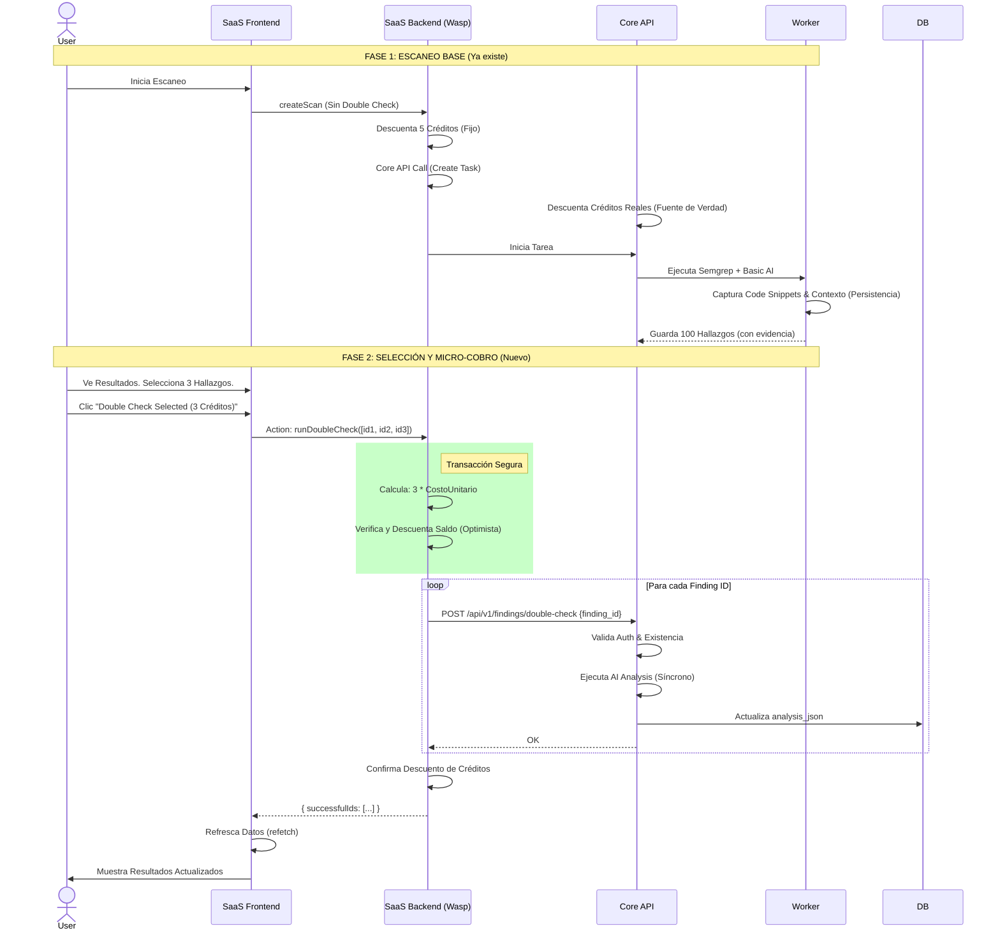

# Plan de Refactorización: Economía de Créditos On-Demand (Modelo Interactivo)

## 1. Cambio de Paradigma: Del "Cobro Estimado" al "Cobro Exacto"

Esta estrategia reemplaza el modelo de "Liquidación Diferida" (Deuda/Saldos Negativos) por un modelo **Interactivo On-Demand**.

*   **Antes (Problema)**: El usuario debía decidir *antes* de ver los resultados si quería Double Check. El sistema cobraba "por si acaso" o generaba deuda.
*   **Ahora (Solución)**:
    1.  **Fase 1 (Escaneo Base)**: Costo fijo y bajo (ej. 5 créditos). Detecta vulnerabilidades con Semgrep + IA ligera.
    2.  **Fase 2 (Selección)**: El usuario ve 50 hallazgos, pero solo le interesan 3 críticos.
    3.  **Fase 3 (Micro-transacción)**: Selecciona los 3 hallazgos y pulsa "Verificar con IA Profunda".
    4.  **Cobro Exacto**: El sistema cobra 3 créditos (3 * 1). Sin estimaciones, sin deuda.

---

## 2. Arquitectura del Nuevo Flujo

Basado en `ANALISIS_ARQUITECTURA_FULLSTACK.md`:

---

## 3. Estado del Proyecto (Roadmap de Refactorización)

### ✅ Implementado (Completado)
1.  **Persistencia de Evidencia (DB)**: 
    - Migración `024_add_finding_evidence.sql` aplicada.
    - Columnas `code_snippet`, `context_snippet` y `snippet_fix` añadidas a `securetag.finding`.
2.  **Captura de Evidencia (Worker)**:
    - `TaskExecutor.ts` modificado para guardar `codeSnippet` y `extendedContext` durante el escaneo.
    - `securetag-worker` reconstruido y verificado.
3.  **API Endpoint Core (On-Demand)**:
    - Endpoint `POST /api/v1/findings/double-check` creado en `src/server/routes/findings.ts`.
    - Integra autenticación, validación de créditos y ejecución de IA (Síncrono).
4.  **Infraestructura**:
    - `securetag-app` configurado con keys de IA (`AI_PROVIDER_*`) para permitir ejecución directa.
    - `TaskExecutor.ts` (Legacy) actualizado para no ejecutar double check automático.
5.  **Limpieza Legacy**:
    - `openapi.yaml`: Parámetro `double_check_config` marcado como deprecated.
    - `NewScanPage.tsx`: Opción de Double Check automático (Legacy) eliminada y errores de compilación resueltos.
6.  **Frontend (UI & Lógica)**:
    - `SastReportPage.tsx`: Interfaz completa y refinada.
        - **Modo Selección Inteligente**: Botón 'Select' que filtra automáticamente hallazgos no verificados.
        - **Selector de Modelo On-Demand**: Soporte para elegir nivel de análisis (Standard, Pro, Max) antes de confirmar.
        - **Feedback Visual Avanzado**: Sistema de iconos jerárquicos (Cerebros Azul/Ámbar/Verde) para denotar origen (Argus/Lynceus) y consenso.
        - **UX de Verificación**: Flujo de confirmación con estados de carga ("Processing") y animaciones suaves.
        - **Feedback de Error**: Badge de estado "failed" ahora en rojo para visibilidad inmediata.
    - `sast.ts`: Acción `runDoubleCheck` actualizada para enviar el modelo seleccionado.
    - Contenedor `opensaas-app` estable y funcional.
7.  **Robustez y Seguridad (Worker/Core)**:
    - **Reembolso por Falla**: Implementado en `TaskExecutor.ts` y `CreditsManager.ts`. Si una tarea falla, se reembolsan los créditos automáticamente al tenant.
    - **Reembolso Parcial (Reglas)**: Si no se generan todas las reglas solicitadas, se reembolsan los créditos correspondientes a las reglas faltantes.
    - **Detección de Infraestructura**: `ContextAnalyzer.ts` ahora detecta Terraform (`.tf`), Serverless (`serverless.yml`), GitHub Actions y GitLab CI para contexto enriquecido.
    - **Fallback de Detección de Lenguaje**: Si la detección principal falla (ej. proyecto pequeño o estructura no estándar), se intenta detectar por extensión de archivo.
    - **Propagación de Modelo de Reglas**: Corregido bug donde el modelo seleccionado (Pro/Max) no llegaba al Worker; ahora se pasa explícitamente en el payload de la tarea.
    - **Corrección de Identidad**: Solucionado problema donde el worker usaba identidad de sistema en lugar del tenant del usuario.

### 🔄 En Progreso (Siguiente Paso)
1.  **Validación Final**:
    - Reconstrucción de imágenes Docker (`securetag-worker`, `securetag-app`).
    - Prueba de humo: Ejecutar escaneo completo con Custom Rules (Pro) y verificar:
        - Cobro inicial correcto.
        - Generación de reglas usando el modelo Pro (verificar logs de fee).
        - Reembolso en caso de fallo forzado (opcional).
    - Verificación de que la detección de lenguaje por extensión funciona en proyectos "vacíos" de estructura.

### ⏳ Pendiente (Futuro)
1.  **Limpieza de Código**:
    - Resolver errores de linter en el frontend (módulos wasp faltantes en imports).
    - Eliminar código muerto relacionado con el antiguo sistema de cobro en worker.
2.  **Optimizaciones**:
    - Implementar `POST /api/v1/findings/batch-double-check`.

---

## 4. Detalle Técnico de Implementación (Referencia)

### Flujo Simplificado (Implementado)
Se optó por un enfoque síncrono para la fase inicial del On-Demand, donde el Wasp Backend orquesta las llamadas al Core API. Esto simplifica la arquitectura al no requerir un nuevo tipo de Job en el Worker inmediatamente, aprovechando que el análisis individual es rápido.

### Estrategia de Solución: Cobro en Dos Fases con Liquidación Final
1.  **Fase 1: Deducción Preventiva (Hold)**
    - El Core API deduce el costo total al crear la tarea (`queued`).
2.  **Fase 2: Ejecución y Reembolso**
    - Si la tarea falla o no se consumen todos los recursos (ej. menos reglas generadas), el Worker (o Core) calcula la diferencia y emite un reembolso (Refund) directo a la base de datos.
3.  **Fase 3: Sincronización UI**
    - El Frontend sincroniza su saldo local consultando al Core, garantizando consistencia eventual.
